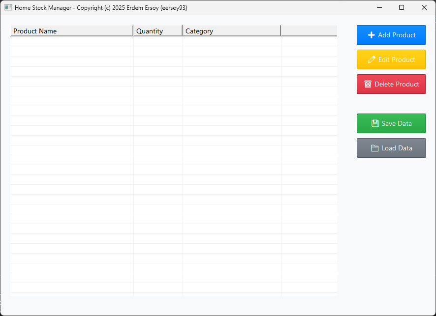

# Home Stock Manager 🏠📦

A modern and user-friendly home stock management application. You can easily track stock quantities of products in your home, organize them by categories, and store data securely.



## ✨ Features

### 🎯 Core Features
- **Product Management**: Add, edit, and delete products
- **Stock Tracking**: Real-time stock quantity tracking
- **Category System**: Organize products by categories
- **Data Storage**: Automatic data saving and loading
- **UTF-8 Support**: Turkish character support

### 🎨 Modern Interface
- **Clean Design**: Modern and minimalist user interface
- **Emoji-Enabled Buttons**: Visually rich button design
- **Color-Coded Theme**: Color coding for different button types
- **Responsive Layout**: Design that adapts to window size

### 🔧 Technical Features
- **C Language**: Developed in C for high performance
- **Windows API**: Native Windows application
- **ListView Control**: Advanced list view
- **Binary Data Format**: Fast data reading/writing
- **Memory Management**: Safe memory usage

## 🚀 Installation

### Requirements
- Windows 10/11
- MinGW-w64 (GCC compiler)
- Make tool

### Build Steps

1. **Download source code**:
   ```bash
   git clone https://github.com/eersoy93/home-stock-manager.git
   cd home-stock-manager
   ```

2. **Build the project**:
   ```bash
   make
   ```

3. **Run the application**:
   ```bash
   make run
   ```

### Alternative Build Options

- **Debug version**: `make debug`
- **Release version**: `make release`
- **Clean**: `make clean`
- **Rebuild**: `make rebuild`

## 📱 Usage

### Main Screen
When you open the application, you'll see a modern interface:
- **Left side**: Product list (ListView)
- **Right side**: Action buttons

### Button Descriptions
- **➕ Add Product** (Blue): Add new product
- **✏️ Edit Product** (Yellow): Edit selected product
- **🗑️ Delete Product** (Red): Delete selected product
- **💾 Save Data** (Green): Save data
- **📁 Load Data** (Gray): Load data

### Adding/Editing Products
1. Click "Add Product" or "Edit Product" button
2. In the dialog window that opens:
   - **Product Name**: Enter the product name
   - **Category**: Specify the product category
   - **Stock Quantity**: Enter the current stock count
3. Click "OK" to save

### Data Management
- **Auto Loading**: Application automatically loads `stock_data.dat` file on startup
- **Manual Saving**: Save data with "Save Data" button
- **Manual Loading**: Load data with "Load Data" button

## 🏗️ Project Structure

```
home-stock-manager/
├── main.c          # Main program file
├── stock.c         # Stock management functions
├── stock.h         # Stock management header file
├── theme.c         # Theme and UI functions
├── theme.h         # Theme header file
├── resource.h      # Windows resource definitions
├── resource.rc     # Windows resource file
├── Makefile        # Build file
└── README.md       # This file
```

## 🔧 Technical Details

### Data Structures
```c
typedef struct {
    char name[256];           // Product name
    char category[128];       // Category
    int stock;               // Stock quantity
    int id;                  // Unique ID
} StockItem;

typedef struct {
    StockItem items[1000];   // Maximum 1000 products
    int itemCount;           // Current product count
    int nextId;              // Next ID
} StockManager;
```

### Theme System
- **Light Theme**: Modern white theme
- **Dark Theme**: Dark mode support (future version)
- **Color Coding**: Different colors for different functions

### File Format
Data is stored in binary format in `stock_data.dat` file:
- Header: Item count and next ID
- Items: Binary data for each product

## 🛠️ Development

### Compilation Flags
```makefile
CFLAGS = -Wall -Wextra -std=c99 -D_WIN32_WINNT=0x0600 
         -DUNICODE -D_UNICODE -finput-charset=UTF-8 
         -fexec-charset=UTF-8
```

### Dependencies
```makefile
LDFLAGS = -mwindows -luser32 -lgdi32 -lcomctl32 -lcomdlg32 
          -lkernel32 -lmsimg32 -luxtheme
```

## 📋 Feature List

### Current Features ✅
- [x] Product add/edit/delete
- [x] Stock quantity tracking
- [x] Category system
- [x] Data save/load
- [x] Modern UI design
- [x] UTF-8 character support
- [x] Emoji-enabled buttons

### Future Features 🔮
- [ ] Search and filtering
- [ ] Low stock alerts
- [ ] Stock history
- [ ] Data export (CSV, JSON)
- [ ] Dark theme
- [ ] Multi-language support

## 🤝 Contributing

1. Fork this repository
2. Create a new branch (`git checkout -b feature/new-feature`)
3. Commit your changes (`git commit -am 'Add new feature'`)
4. Push your branch (`git push origin feature/new-feature`)
5. Create a Pull Request

## 📄 License

Copyright (c) 2025 Erdem Ersoy (eersoy93)

This project is licensed under the MIT License. See the LICENSE file for details.

## 📞 Contact

If you have any questions or suggestions, please open an issue.

---

**Home Stock Manager** - Manage your home stock smartly! 🏠✨
